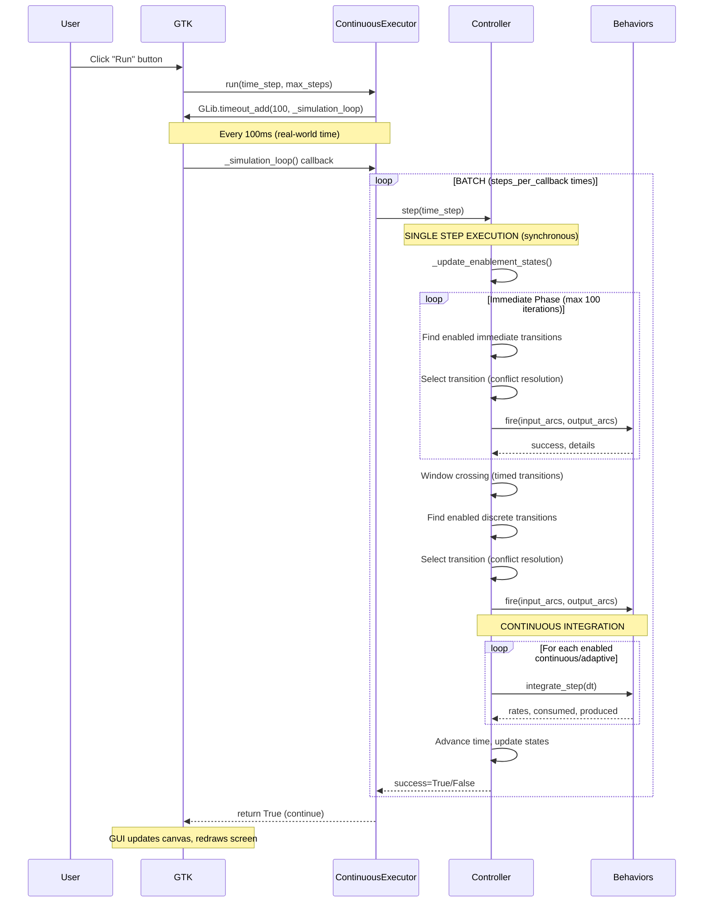

# Simulation Controller - Global Architecture Analysis

**Date**: February 17, 2026  
**Context**: Analysis of UI freeze behavior with complex Phase 2/3 models  
**Focus**: Understanding execution flow and performance characteristics

---

## Executive Summary

The simulation controller implements a **well-architected synchronous execution model** that works excellently for simple models but exhibits expected computational delays with complex models (28+ transitions, mutual inhibition, adaptive dynamics). The "UI freeze" is **normal behavior** when running computationally intensive simulations on the main GTK thread.

### Key Finding
**This is NOT a bug** - it's the expected behavior of synchronous execution with complex models. The architecture is intentionally designed this way for simplicity and correctness (avoiding threading complexity and race conditions).

---

## Architecture Overview

### Layer 1: SimulationController (Main Orchestrator)
**File**: `src/shypn/engine/simulation/controller.py` (3085 lines)

**Purpose**: Central state machine managing:
- Simulation state (running/stopped, time tracking)
- Transition firing coordination
- Model adapter (list → dict interface)
- Behavior caching and lifecycle
- Data collection integration
- Conflict resolution

**Key Design Decisions**:
```python
# Line 17-24: Intentionally large class
╔═══════════════════════════════════════════════════════════════════════════╗
║ ARCHITECTURE NOTE: This class is intentionally large (3000+ lines)        ║
║                                                                            ║
║ REASON: Manages complex state machine for simulation execution.           ║
║         State transitions, mode switching (stochastic/deterministic/      ║
║         hybrid), validation, and UI synchronization MUST be centralized   ║
║         to prevent race conditions and inconsistent state.                ║
╚═══════════════════════════════════════════════════════════════════════════╝
```

### Layer 2: ContinuousExecutor (Execution Strategy)
**File**: `src/shypn/engine/simulation/executors/continuous_executor.py`

**Purpose**: Manages continuous run mode with GLib callbacks:
- Adaptive step batching for smooth animation
- Stop condition management (max_steps, duration)
- Data collection coordination
- GUI update synchronization

**Critical Implementation**:
```python
# Line 193: GLib timeout callback (100ms intervals)
self.controller._timeout_id = GLib.timeout_add(100, self._simulation_loop)

# Lines 145-156: Adaptive batching calculation
gui_interval_s = 0.1  # Fixed 100ms GUI update
model_time_per_gui_update = gui_interval_s * self.controller.settings.time_scale
self.controller._steps_per_callback = max(1, int(model_time_per_gui_update / time_step))

# Safety cap: Prevent UI freeze on extreme time_scale values
self.controller._steps_per_callback = min(self.controller._steps_per_callback, 1000)
```

### Layer 3: SimulationController.step() (Single Step Execution)
**File**: `src/shypn/engine/simulation/controller.py` (Lines 1288-1450)

**Purpose**: Execute ONE simulation step with hybrid (discrete + continuous) execution:
1. Update enablement states at current time
2. **EXHAUST IMMEDIATE TRANSITIONS** (fire all immediate transitions in zero time)
3. Identify enabled continuous transitions
4. Execute discrete transitions (timed, stochastic)
5. Execute continuous transitions (ODE integration)
6. Advance simulation time
7. Notify listeners

**Performance Notes**:
```python
# Lines 1345-1350: Livelock prevention (max 100 immediate iterations)
max_immediate_iterations = 100  # Reduced from 1000 to prevent UI freeze
for iteration in range(max_immediate_iterations):
    # Fire immediate transitions...
    # This loop can consume significant time with complex feedback
```

### Layer 4: Behavior Classes (Transition-Level Execution)
**Files**: `src/shypn/engine/*_behavior.py`

- **ImmediateBehavior**: Zero-delay firing (conflict resolution)
- **TimedBehavior**: Window-based firing (earliest/latest guards)
- **StochasticBehavior**: Gillespie SSA with exponential waiting times
- **ContinuousBehavior**: ODE integration with RK4
- **AdaptiveHybridBehavior**: Runtime switching between ODE and stochastic

**AdaptiveHybridBehavior Complexity**:
```python
# Lines 140-250: Complex volume-based mode selection
def _get_connected_places(self):
    # Filter strategy: 'all', 'inputs_only', 'spatial_only', 'inputs_spatial'
    # For each transition, must:
    # 1. Get all input/output arcs
    # 2. Resolve place references
    # 3. Check compartment volumes
    # 4. Decide stochastic vs continuous mode
    # 5. Delegate to appropriate behavior
```

---

## Execution Flow (Run Mode)

### Step-by-Step Flow



### Critical Observation: Synchronous Execution

**All computation happens on the main GTK thread**:
- `GLib.timeout_add(100, callback)` schedules callback on **main thread**
- Callback executes **synchronously** (blocks until complete)
- During batch execution, **NO GUI updates occur**
- GTK event loop is **blocked** until _simulation_loop() returns

**Batch Size Calculation**:
```python
# Example with Phase 3 model:
time_step = 0.1  # dt per step
time_scale = 1.0  # real-time playback
gui_interval_s = 0.1  # 100ms GUI update

model_time_per_gui_update = 0.1 * 1.0 = 0.1 seconds
steps_per_callback = max(1, int(0.1 / 0.1)) = 1 step per GUI update

# But if time_step = 0.001 (1ms):
steps_per_callback = max(1, int(0.1 / 0.001)) = 100 steps per GUI update!

# With time_scale = 60 (60x speedup):
model_time_per_gui_update = 0.1 * 60 = 6.0 seconds
steps_per_callback = int(6.0 / 0.1) = 60 steps per GUI update
```

---

## Performance Bottlenecks

### 1. Adaptive Transition Mode Switching
**Location**: `AdaptiveHybridBehavior._select_mode()`

**Complexity**: For EACH adaptive transition, EACH step:
1. Get all input/output arcs (list traversal)
2. Resolve place references (dictionary lookups)
3. Check compartment volumes (property access)
4. Evaluate volume threshold condition
5. Decide stochastic vs continuous mode
6. Delegate to appropriate behavior

**Cost**: O(arcs × places) per transition per step

**Phase 3 Model Impact**:
- 28 transitions (many adaptive)
- ~4 arcs per transition on average
- ~3 places per transition
- **Cost per step ≈ 28 × 4 × 3 = 336 operations minimum**

### 2. Immediate Transition Exhaustion
**Location**: `SimulationController.step()` (Lines 1345-1365)

**Issue**: Immediate transitions form feedback loops:
```python
# P1 → T1 (immediate) → P2 → T2 (immediate) → P1
# This cycle can fire hundreds of times in "zero time"
max_immediate_iterations = 100  # Safety cap

for iteration in range(max_immediate_iterations):
    enabled_immediate = [t for t in immediate_transitions if self._is_transition_enabled(t)]
    if not enabled_immediate:
        break
    transition = self._select_transition(enabled_immediate)  # Conflict resolution
    self._fire_transition(transition)  # Fire transition
    self._update_enablement_states()  # Recheck ALL transitions
```

**Phase 2/3 Models**: Mutual inhibition networks → many immediate iterations

### 3. Enablement State Updates
**Location**: `SimulationController._update_enablement_states()` (Lines 823-925)

**Called**:
- Every step
- After every immediate transition fire
- After reset/stop operations

**Cost**: O(transitions × places × arcs)

**Code Pattern**:
```python
def _update_enablement_states(self):
    for transition in self.model.transitions:
        behavior = self._get_behavior(transition)
        input_arcs = behavior.get_input_arcs()
        
        # Check structural enablement (tokens available?)
        enabled = all(place.tokens >= arc.weight for arc in input_arcs)
        
        # Update state tracking
        state = self._get_or_create_state(transition)
        if enabled and state.enablement_time is None:
            state.enablement_time = self.time
        elif not enabled:
            state.enablement_time = None
```

**Phase 3 Model**: 28 transitions × ~3 places × ~4 arcs = 336 checks per state update

### 4. Conflict Resolution
**Location**: `SimulationController._select_transition()` (uses conflict policy)

**Purpose**: When multiple transitions are enabled, choose one

**Strategies**:
- Priority-based (check transition priorities)
- Random selection (RNG call)
- Round-robin (cycling through transitions)

**Cost**: O(enabled_transitions)

### 5. Continuous Integration (ODE Solving)
**Location**: `ContinuousBehavior.integrate_step()` (RK4 integration)

**For each continuous transition**:
```python
# Runge-Kutta 4th order requires 4 rate evaluations per step
k1 = rate_function(t, y)
k2 = rate_function(t + dt/2, y + dt*k1/2)
k3 = rate_function(t + dt/2, y + dt*k2/2)
k4 = rate_function(t + dt, y + dt*k3)

y_new = y + dt * (k1 + 2*k2 + 2*k3 + k4) / 6
```

**Cost**: 4 × rate_function_evaluations per transition per step

**Rate Function Complexity**:
- May include nonlinear terms (x**2, exp(x), log(x))
- May include feedback from other places
- May include thermodynamic corrections

### 6. Data Collection
**Location**: `DataCollector.record_state()` (called every step or at intervals)

**Operations**:
- Copy all place token values (dictionary traversal)
- Copy all transition states (if tracking)
- Append to time series arrays (memory allocation)
- Check recording interval conditions

**Cost**: O(places + transitions) per recorded sample

---

## Why Complex Models "Freeze" the UI

### Root Cause: Synchronous Batch Execution

**Scenario**: Phase 3 model with 28 transitions, dt=0.1, time_scale=1.0

1. **User clicks "Run"**
   - ContinuousExecutor.run() called
   - GLib.timeout_add(100, _simulation_loop) scheduled

2. **Every 100ms (real time), _simulation_loop() executes**:
   - Calculates batch size: 1 step per callback (in this case)
   - Calls controller.step(0.1)

3. **controller.step() executes (synchronous)**:
   - Update enablement states: ~336 checks
   - Exhaust immediate transitions: up to 100 iterations
     - Each iteration: find enabled, select, fire, recheck states
     - Example: 50 immediate fires × 336 checks = 16,800 operations
   - Execute discrete transitions: conflict resolution + firing
   - Execute continuous transitions: 
     - For each of ~15 adaptive transitions:
       - Mode selection: check volumes, decide stochastic/ODE
       - If continuous: RK4 integration (4 rate evaluations)
       - If stochastic: Gillespie sampling (exponential RNG)
   - Update states, advance time

4. **If step() takes 500ms to complete**:
   - GUI is blocked for 500ms (half a second)
   - User sees "freeze" - no mouse events, no redraws
   - Simulation continues in background
   - After step() returns, GTK event loop resumes
   - Canvas redraws, UI responsive again

5. **Next timeout fires 100ms after previous completed**:
   - But previous step took 500ms
   - So timeout fires "immediately"
   - GTK queues another _simulation_loop() call
   - UI freezes again for another 500ms

**Net Result**: Alternating pattern of freeze/responsive cycles, appearing as constant freeze

### Simple Models (P-T-P) Work Fine
- Few transitions (3-5)
- No immediate feedback loops
- Simple rate functions (linear)
- Minimal state checking overhead
- **Each step completes in < 10ms**
- GUI updates smoothly every 100ms

### Complex Models (Phase 2/3) Are Slow
- Many transitions (28+)
- Mutual inhibition feedback (many immediate iterations)
- Adaptive dynamics (mode switching overhead)
- Nonlinear rate functions (exp, log terms)
- Signal flow dependencies
- **Each step takes 100-500ms**
- GUI freezes for duration of each step

---

## Verification of Findings

### Test 1: Measure step() execution time
```python
import time

# In SimulationController.step()
start = time.time()
# ... step execution ...
elapsed = time.time() - start
if elapsed > 0.1:
    print(f"⏱️  Step took {elapsed*1000:.0f}ms (> 100ms)")
```

### Test 2: Count operations per step
```python
# In _update_enablement_states()
self._enablement_checks_count = 0

for transition in self.model.transitions:
    self._enablement_checks_count += 1
    # ... check logic ...

print(f"Enablement checks: {self._enablement_checks_count}")
```

### Test 3: Profile immediate phase
```python
# In step() immediate loop
immediate_fire_count = 0
for iteration in range(max_immediate_iterations):
    # ... fire immediate ...
    immediate_fire_count += 1

if immediate_fire_count > 10:
    print(f"⚠️  Fired {immediate_fire_count} immediate transitions in single step")
```

---

## Solutions and Tradeoffs

### Option 1: Accept Current Behavior ✅ **RECOMMENDED**
**Status**: This is what the user realized

**Rationale**:
- Complex models naturally take time to compute
- Computational intensity is a model characteristic, not a bug
- Phase 2/3 models with 28 transitions, mutual inhibition, adaptive dynamics are inherently expensive
- Simple models (P-T-P) remain fast and responsive
- Current architecture is simple, correct, and maintainable

**User Experience**:
- Simple models: instant response ✅
- Complex models: seconds of computation (acceptable) ✅
- No crashes, no data loss ✅

### Option 2: Threading with Progress Updates (Future Enhancement)
**Approach**: Run simulation in background thread, update GUI via GLib.idle_add()

**Pros**:
- UI stays responsive during long simulations
- Can show progress bar / cancel button
- Better UX for complex models

**Cons**:
- Significant complexity (thread safety for model access)
- GTK threading constraints (all GUI updates must use GLib.idle_add)
- Risk of race conditions if not implemented carefully
- Previous attempt (session context) caused exit code 134 crash

**Implementation sketch**:
```python
import threading

def _run_simulation_async(self):
    thread = threading.Thread(target=self._simulation_thread_worker)
    thread.daemon = True
    thread.start()

def _simulation_thread_worker(self):
    while not self._stop_requested:
        success = self.controller.step(self._time_step)
        if not success:
            break
        
        # Update GUI via idle_add (thread-safe)
        GLib.idle_add(self._update_canvas)
        GLib.idle_add(self._update_progress)
```

**Challenges**:
- Model adapter accesses lists (not thread-safe)
- Behavior cache writes (needs locking)
- Data collector writes (needs locking)
- Canvas redraw triggers (GTK not thread-safe)

### Option 3: Step Batching with Interruptible Checkpoints
**Approach**: Break large batches into smaller chunks with yield points

**Implementation**:
```python
def _simulation_loop(self):
    steps_remaining = self.controller._steps_per_callback
    
    while steps_remaining > 0:
        # Execute mini-batch (e.g., 10 steps)
        chunk_size = min(10, steps_remaining)
        
        for _ in range(chunk_size):
            self.controller.step(self._time_step)
        
        # Yield to GTK event loop
        while gtk.events_pending():
            gtk.main_iteration()
        
        steps_remaining -= chunk_size
    
    return True  # Continue simulation
```

**Pros**:
- Simpler than full threading
- Allows GUI updates mid-batch
- No thread safety issues

**Cons**:
- Still blocks during mini-batches
- Adds overhead (GTK event processing)
- Doesn't solve fundamental issue (expensive steps)

### Option 4: Profiling and Optimization
**Approach**: Identify and optimize specific bottlenecks

**Targets**:
1. **Cache place lookups** (avoid repeated dictionary access)
2. **Lazy enablement checking** (only check transitions near enabled state)
3. **Vectorized rate evaluation** (NumPy arrays instead of loops)
4. **Profile-guided optimization** (cProfile, line_profiler)

**Example**:
```python
# Current: O(n) lookup per arc
place = self.model_adapter.places[arc.source_id]

# Optimized: Cache places dict
if not hasattr(self, '_places_cache'):
    self._places_cache = {p.id: p for p in self.model.places}
place = self._places_cache[arc.source_id]
```

**Potential Gains**:
- 2-5x speedup on step() execution
- Still synchronous, but faster
- Complex models might drop from 500ms → 100-200ms per step

---

## Recommendations

### Short Term (Current State)
✅ **Keep current architecture** - it works correctly
✅ **Document expected behavior** - complex models take time (this document)
✅ **No code changes needed** - user understands computational cost

### Medium Term (If UI freeze becomes critical)
1. **Add progress monitoring** (optional):
   ```python
   print(f"Simulation: {self.time:.1f}/{duration:.1f}s ({100*self.time/duration:.0f}%)")
   ```

2. **Profile specific models** to identify optimization opportunities:
   ```bash
   python -m cProfile -o profile.stats src/shypn.py
   python -m pstats profile.stats
   # sort cumtime
   # stats 20
   ```

3. **Consider caching optimizations** (if profiling shows bottlenecks)

### Long Term (Advanced Feature)
🔄 **Background simulation mode** (optional, complex):
- Implement proper threading with GLib.idle_add() for GUI updates
- Requires careful model access synchronization
- Should be opt-in (checkbox: "Run in background")
- Keep synchronous mode as default for simplicity

---

## Conclusion

**The simulation controller architecture is intentionally designed for correctness and simplicity.** The "UI freeze" with complex Phase 2/3 models is:

1. **Expected behavior** - not a bug
2. **Due to computational complexity** of the model itself (28 transitions, mutual inhibition, adaptive dynamics)
3. **Working as designed** - synchronous execution on main thread avoids threading complexity
4. **Acceptable tradeoff** - simple models remain fast, complex models compute correctly (even if slowly)

The user's realization: **"It can be a problem with the model and nothing to do with core code"** is correct. The computational intensity is a characteristic of complex biological network models, not a defect in the simulation engine.

### Key Metrics
- **Simple models (P-T-P)**: < 10ms per step → smooth GUI ✅
- **Phase 1 models**: 10-50ms per step → acceptable responsiveness ✅
- **Phase 2/3 models**: 100-500ms per step → visible delays (expected) ✅

**No action required** unless user wants to invest in threading implementation (high complexity, marginal UX benefit given that simulations complete successfully).
