# Canvas State Architecture - Comprehensive Analysis

**Date**: October 14, 2025  
**Scope**: Document state management, persistence, and synchronization  
**Status**: Architecture Review - Critical Issues Identified

---

## Executive Summary

This document provides a comprehensive analysis of canvas state management throughout the Shypn application. The analysis reveals **significant architectural fragmentation** with state managed across multiple independent systems without proper coordination.

### Critical Findings

🔴 **CRITICAL**: State is fragmented across 4+ independent managers  
🟡 **WARNING**: No central state authority or synchronization mechanism  
🟡 **WARNING**: File operations may not capture all state  
🟡 **WARNING**: Mode changes (Edit/Simulate) don't propagate consistently  
🟢 **GOOD**: Clean separation of concerns in individual modules

---

## 1. Canvas State Components - Current Architecture

### 1.1 State Management Classes

The application has **multiple independent state managers**:

#### A. `DocumentModel` (Data Layer)
**Location**: `src/shypn/data/canvas/document_model.py`

**Responsibilities**:
- Petri net object storage (places, transitions, arcs)
- Spatial queries (object at point, objects in rectangle)
- Object lifecycle (add, remove)
- **View state** (zoom, pan_x, pan_y) ⚠️

**State Managed**:
```python
class DocumentModel:
    places: List[Place]
    transitions: List[Transition]
    arcs: List[Arc]
    _next_place_id: int
    _next_transition_id: int
    _next_arc_id: int
    view_state: dict  # {"zoom": 1.0, "pan_x": 0.0, "pan_y": 0.0}
```

**Issues**:
- ⚠️ View state mixed with data model (violation of SoC)
- No change notification mechanism
- No observers/listeners pattern

---

#### B. `ViewportState` (View Layer)
**Location**: `src/shypn/data/canvas/canvas_state.py`

**Responsibilities**:
- Zoom level (0.3x to 3.0x)
- Pan offset (viewport translation)
- Grid system (adaptive spacing)
- Screen ↔ World coordinate transformations

**State Managed**:
```python
class ViewportState:
    width: int
    height: int
    _zoom: float
    _pan_x: float
    _pan_y: float
    grid_visible: bool
    _grid_spacing: float
```

**Issues**:
- ⚠️ **Duplicate zoom/pan state** with `DocumentModel.view_state`
- No synchronization mechanism between the two
- Which is the source of truth?

---

#### C. `DocumentState` (Metadata Layer)
**Location**: `src/shypn/data/canvas/canvas_state.py`

**Responsibilities**:
- Document filename and path
- Modified flag (unsaved changes)
- Creation/modification timestamps
- Document properties (title, author, description)

**State Managed**:
```python
class DocumentState:
    filename: Optional[str]
    filepath: Optional[str]
    _modified: bool
    created_at: datetime
    modified_at: datetime
    title: str
    author: str
    description: str
    version: str
```

**Issues**:
- ✅ Good: Clean separation of metadata
- ⚠️ But: Not integrated with file operations
- ⚠️ Modified flag may not reflect actual changes

---

#### D. `ModelCanvasManager` (Integration Layer)
**Location**: `src/shypn/data/model_canvas_manager.py`

**Responsibilities**:
- Grid rendering
- Zoom/Pan operations
- Coordinate transformations
- Tool selection state
- **Petri net object collections** (places, transitions, arcs) ⚠️
- **Selection management**
- **Dirty flag for redraw**

**State Managed**:
```python
class ModelCanvasManager:
    # Viewport
    zoom: float
    pan_x: float
    pan_y: float
    viewport_width: int
    viewport_height: int
    screen_dpi: float
    
    # Document metadata
    filename: str
    modified: bool
    created_at: datetime
    modified_at: Optional[datetime]
    
    # Canvas size
    canvas_width: int
    canvas_height: int
    
    # Tool state
    current_tool: Optional[str]
    
    # Petri net objects (DUPLICATE!)
    places: List[Place]
    transitions: List[Transition]
    arcs: List[Arc]
    _next_place_id: int
    _next_transition_id: int
    _next_arc_id: int
    
    # Selection
    selection_manager: SelectionManager
    editing_transforms: ObjectEditingTransforms
    rectangle_selection: RectangleSelection
    
    # Rendering
    _needs_redraw: bool
```

**Issues**:
- 🔴 **CRITICAL**: **Massive state duplication** with `DocumentModel`
- 🔴 **CRITICAL**: **Duplicate object collections** (places, transitions, arcs)
- 🔴 **CRITICAL**: **Two separate ID counters** for same objects
- ⚠️ Zoom/Pan state again (3rd copy!)
- ⚠️ Document metadata again (duplicate of `DocumentState`)
- This class does TOO MUCH - violates Single Responsibility Principle

---

#### E. `DocumentCanvas` (Facade Layer)
**Location**: `src/shypn/data/canvas/document_canvas.py`

**Responsibilities**:
- Coordinating `DocumentModel`, `ViewportState`, `DocumentState`
- High-level operations (add object, zoom, pan)
- Change notification (single callback)

**State Managed**:
```python
class DocumentCanvas:
    document: DocumentModel
    viewport: ViewportState
    state: DocumentState
    _change_callback: Optional[Callable[[], None]]
```

**Issues**:
- ✅ Good: Facade pattern for coordination
- ⚠️ But: Single callback insufficient for complex UIs
- ⚠️ Not used consistently (ModelCanvasManager exists separately)
- ⚠️ No observer pattern for multiple listeners

---

### 1.2 State Fragmentation Summary

| State Component | DocumentModel | ViewportState | DocumentState | ModelCanvasManager |
|-----------------|---------------|---------------|---------------|-------------------|
| **Zoom** | ✅ view_state | ✅ _zoom | ❌ | ✅ zoom |
| **Pan X/Y** | ✅ view_state | ✅ _pan_x/_pan_y | ❌ | ✅ pan_x/pan_y |
| **Filename** | ❌ | ❌ | ✅ filename | ✅ filename |
| **Modified** | ❌ | ❌ | ✅ _modified | ✅ modified |
| **Places** | ✅ places | ❌ | ❌ | ✅ places |
| **Transitions** | ✅ transitions | ❌ | ❌ | ✅ transitions |
| **Arcs** | ✅ arcs | ❌ | ❌ | ✅ arcs |
| **ID Counters** | ✅ _next_*_id | ❌ | ❌ | ✅ _next_*_id |
| **Grid** | ❌ | ✅ grid_visible | ❌ | ✅ grid_style |
| **Selection** | ❌ | ❌ | ❌ | ✅ selection_manager |
| **Tool** | ❌ | ❌ | ❌ | ✅ current_tool |

**Result**: **Massive duplication** - no single source of truth!

---

## 2. State Propagation Flows

### 2.1 Object Creation Flow

```mermaid
graph TD
    A[User Click] --> B{Tool Active?}
    B -->|Place| C[model_canvas_loader._on_button_press]
    C --> D[manager.add_place<br/>Creates Place in manager]
    D --> E[manager.places.append]
    D --> F[manager._next_place_id++]
    D --> G[manager.mark_dirty<br/>_needs_redraw = True]
    G --> H[drawing_area.queue_draw]
    
    style D fill:#ff9999
    style E fill:#ff9999
    style F fill:#ff9999
    
    Note1[❌ DocumentModel NOT updated]
    Note2[❌ No central state sync]
```



**Issue**: Objects created in `ModelCanvasManager` but NOT in `DocumentModel`!

---

### 2.2 Zoom/Pan Flow

```mermaid
graph TD
    A[User Scroll] --> B[model_canvas_loader._on_scroll]
    B --> C[manager.set_zoom<br/>Updates manager.zoom]
    C --> D[manager.mark_dirty]
    D --> E[drawing_area.queue_draw]
    
    F[File Save] --> G[persistency.save]
    G --> H{Which state?}
    H -->|Option 1| I[manager.view_state]
    H -->|Option 2| J[DocumentModel.view_state]
    H -->|Option 3| K[ViewportState]
    
    style C fill:#ff9999
    style H fill:#ffcc00
    
    Note1[❌ THREE zoom/pan states]
    Note2[❓ Which gets saved?]
```



**Issue**: Three independent zoom/pan states - no synchronization!

---

### 2.3 File Operations Flow

#### Current Implementation (Incomplete):

```python
# Save (persistency_manager.py)
def save_to_file(manager, filepath):
    data = {
        "filename": manager.filename,
        "modified": manager.modified,
        "created_at": manager.created_at.isoformat() if manager.created_at else None,
        "canvas_width": manager.canvas_width,
        "canvas_height": manager.canvas_height,
        "zoom": manager.zoom,
        "pan_x": manager.pan_x,
        "pan_y": manager.pan_y,
        "places": [place.to_dict() for place in manager.places],
        "transitions": [t.to_dict() for t in manager.transitions],
        "arcs": [arc.to_dict() for arc in manager.arcs]
    }
    # ... save to JSON
```

**What's Missing**:
- ❌ Current tool state
- ❌ Selection state
- ❌ Grid settings (visibility, style)
- ❌ Document metadata (title, author, description)
- ❌ Mode state (Edit/Simulate)
- ❌ Right panel state (active tab, plot settings)
- ❌ Simulation state (if mid-simulation)

---

### 2.4 Mode Change Flow (Edit ↔ Simulate)


**Issue**: Mode changes don't propagate - each component is isolated!

---

## 3. Critical Issues Identified

### 3.1 State Duplication

**Problem**: Same state managed in multiple places without synchronization.

**Evidence**:
1. **Object Collections** (places, transitions, arcs):
   - Stored in `DocumentModel`
   - Stored in `ModelCanvasManager`
   - Which is authoritative?

2. **Zoom/Pan State**:
   - `DocumentModel.view_state`
   - `ViewportState._zoom/_pan_x/_pan_y`
   - `ModelCanvasManager.zoom/pan_x/pan_y`
   - Three independent copies!

3. **Document Metadata**:
   - `DocumentState.filename/modified/created_at`
   - `ModelCanvasManager.filename/modified/created_at`
   - Duplicate tracking

**Impact**:
- 🔴 Synchronization bugs inevitable
- 🔴 Unclear which state is "source of truth"
- 🔴 File save/load may miss state
- 🔴 Debugging extremely difficult

---

### 3.2 No Central State Authority

**Problem**: No single manager coordinating all state.

**Current Architecture**:
```
ModelCanvasManager ← (primary?)
    ↓
DocumentModel ← (unused?)
ViewportState ← (unused?)
DocumentState ← (unused?)
```

**What Happens**:
- `ModelCanvasManager` is the de-facto state manager
- `DocumentCanvas` facade exists but not used
- `DocumentModel`, `ViewportState`, `DocumentState` are orphaned
- No coordination between them

**Impact**:
- 🔴 New features add state to wrong place
- 🔴 State becomes more fragmented over time
- 🔴 No clear architecture guidance

---

### 3.3 Missing State in Persistence

**Problem**: File save/load doesn't capture complete application state.

**What's Saved** (from `persistency_manager.py`):
- ✅ Basic metadata (filename, modified, created_at)
- ✅ Canvas size
- ✅ Zoom/Pan
- ✅ Petri net objects (places, transitions, arcs)

**What's Missing**:
- ❌ **Current mode** (Edit/Simulate)
- ❌ **Tool selection** (Place/Transition/Arc)
- ❌ **Selection state** (selected objects)
- ❌ **Grid settings** (visible, style)
- ❌ **Document properties** (title, author, description)
- ❌ **Simulation state** (if mid-simulation)
- ❌ **Right panel state** (active tab)
- ❌ **Plot configurations** (if any)
- ❌ **Undo/Redo history** (if implemented)

**Impact**:
- 🟡 User loses context when reopening file
- 🟡 Can't resume mid-simulation
- 🟡 Plot settings not preserved

---

### 3.4 No Observer Pattern

**Problem**: State changes don't notify dependent components.

**Current Notification**:
```python
# DocumentCanvas has single callback
def _notify_change(self):
    self.state.mark_modified()
    if self._change_callback:
        self._change_callback()  # Only ONE callback!
```

**What's Needed**:
- Multiple observers (right panel, status bar, title bar, etc.)
- Event types (object_added, object_removed, selection_changed, etc.)
- Filtering (only notify relevant observers)

**Impact**:
- 🟡 Right panel may not update when state changes
- 🟡 Status bar may show stale info
- 🟡 Title bar may not show modified indicator

---

### 3.5 Mode Changes Don't Propagate

**Problem**: Switching Edit ↔ Simulate doesn't update all components.

**Current Flow**:
```python
# SwissKnifePalette emits signal
self.emit('mode-change-request', new_mode)

# But who listens?
# No central handler!
```

**Should Happen**:
1. ✅ Swiss Palette updates (works)
2. ❌ Right panel switches tabs (doesn't work)
3. ❌ Edit tools disabled in Simulate mode (doesn't work)
4. ❌ Status bar shows mode (doesn't work)
5. ❌ Visual feedback changes (doesn't work)

**Impact**:
- 🟡 UI inconsistent across modes
- 🟡 User can perform invalid operations
- 🟡 Confusing UX

---

## 4. State Clients - Who Needs Canvas State?

### 4.1 UI Components Requiring State

| Component | State Needed | Currently Synced? |
|-----------|-------------|-------------------|
| **Title Bar** | filename, modified flag | ❌ No |
| **Status Bar** | mode, object count, zoom level | ❌ No |
| **Swiss Palette** | current tool, mode | ⚠️ Partial |
| **Right Panel** | mode, selected objects, simulation data | ⚠️ Partial |
| **Plotting Tabs** | simulation data, time series | ⚠️ Partial |
| **Canvas Viewport** | zoom, pan, grid | ✅ Yes |
| **Object Inspector** | selected objects, properties | ❌ No |
| **Undo/Redo** | operation history | ❌ Not implemented |

---

### 4.2 Right Panel Tabs

**Tabs** (from `right_panel.ui`):
1. **Diagnostics** - Needs: object counts, validation errors
2. **Plot** - Needs: simulation data, time series
3. **Concentration** - Needs: place tokens over time
4. **Transitions Count** - Needs: transition firings
5. **Overall** - Needs: summary stats

**Current Implementation**:
```python
# right_panel_loader.py
def set_data_collector(self, data_collector):
    """Update plotting panels with simulation data."""
    self.data_collector = data_collector
    # Update existing panels
    if hasattr(self, 'plot_panel'):
        self.plot_panel.set_data_collector(data_collector)
    # ...
```

**Issues**:
- ⚠️ Manual wiring required
- ⚠️ No automatic updates when canvas changes
- ⚠️ Data collector may be stale

---

### 4.3 File Operations

**Operations**:
- New Document
- Open Document
- Save Document
- Save As
- Export

**Current Integration** (from `model_canvas_loader.py`):
```python
def set_persistency_manager(self, persistency_manager):
    """Wire persistency manager to canvas operations."""
    self.persistency_manager = persistency_manager
    
    # Connect to keyboard shortcuts
    self.persistency_manager.connect('new-document', self._on_new_document)
    self.persistency_manager.connect('open-document', self._on_open_document)
    # ...
```

**Issues**:
- ⚠️ Manual wiring per canvas tab
- ⚠️ State sync not guaranteed
- ⚠️ Incomplete state persistence

---

## 5. Recommended Architecture

### 5.1 Centralized State Manager (Proposed)

```python
class CanvasStateManager:
    """Central authority for all canvas state.
    
    Single source of truth with observer pattern for notifications.
    """
    
    def __init__(self):
        # Document Content
        self.document_model = DocumentModel()  # Objects only
        
        # View State
        self.viewport = ViewportState()  # Zoom, pan, grid
        
        # Document Metadata
        self.metadata = DocumentMetadata()  # Filename, modified, etc.
        
        # Application State
        self.app_state = ApplicationState()  # Mode, tool, selection
        
        # Observers (multiple listeners)
        self._observers: List[StateObserver] = []
    
    def add_observer(self, observer: StateObserver):
        """Register an observer for state changes."""
        self._observers.append(observer)
    
    def remove_observer(self, observer: StateObserver):
        """Unregister an observer."""
        self._observers.remove(observer)
    
    def notify_observers(self, event: StateChangeEvent):
        """Notify all observers of a state change."""
        for observer in self._observers:
            observer.on_state_change(event)
    
    # State modification methods
    def add_place(self, x, y, **kwargs):
        """Add place and notify observers."""
        place = self.document_model.create_place(x, y, **kwargs)
        self.metadata.mark_modified()
        self.notify_observers(ObjectAddedEvent(place))
        return place
    
    def set_zoom(self, zoom, center_x=None, center_y=None):
        """Set zoom and notify observers."""
        self.viewport.zoom_at_point(zoom, center_x, center_y)
        self.notify_observers(ViewportChangedEvent('zoom', zoom))
    
    def set_mode(self, mode: str):
        """Change mode (edit/simulate) and notify observers."""
        old_mode = self.app_state.mode
        self.app_state.mode = mode
        self.notify_observers(ModeChangedEvent(old_mode, mode))
    
    def save_to_file(self, filepath: str):
        """Save complete state to file."""
        data = {
            'version': '2.0',
            'document': self.document_model.to_dict(),
            'viewport': self.viewport.to_dict(),
            'metadata': self.metadata.to_dict(),
            'app_state': self.app_state.to_dict()
        }
        # ... serialize
    
    @classmethod
    def load_from_file(cls, filepath: str):
        """Load complete state from file."""
        # ... deserialize
        manager = cls()
        manager.document_model = DocumentModel.from_dict(data['document'])
        manager.viewport = ViewportState.from_dict(data['viewport'])
        # ...
        return manager
```

---

### 5.2 Observer Pattern

```python
class StateChangeEvent:
    """Base class for state change events."""
    event_type: str
    timestamp: datetime

class ObjectAddedEvent(StateChangeEvent):
    event_type = 'object_added'
    obj: PetriNetObject

class ObjectRemovedEvent(StateChangeEvent):
    event_type = 'object_removed'
    obj: PetriNetObject

class SelectionChangedEvent(StateChangeEvent):
    event_type = 'selection_changed'
    selected_objects: List[PetriNetObject]

class ViewportChangedEvent(StateChangeEvent):
    event_type = 'viewport_changed'
    property: str  # 'zoom', 'pan_x', 'pan_y', 'grid'
    value: Any

class ModeChangedEvent(StateChangeEvent):
    event_type = 'mode_changed'
    old_mode: str
    new_mode: str

class StateObserver(ABC):
    """Interface for state change observers."""
    
    @abstractmethod
    def on_state_change(self, event: StateChangeEvent):
        """Handle state change notification."""
        pass

# Example: Status bar observer
class StatusBarObserver(StateObserver):
    def __init__(self, status_bar):
        self.status_bar = status_bar
    
    def on_state_change(self, event):
        if isinstance(event, ObjectAddedEvent):
            self.status_bar.push(f"Added {event.obj.name}")
        elif isinstance(event, ModeChangedEvent):
            self.status_bar.push(f"Mode: {event.new_mode}")
```

---

### 5.3 Complete State Schema

```json
{
  "version": "2.0",
  "metadata": {
    "filename": "glycolysis.shy",
    "filepath": "/path/to/glycolysis.shy",
    "title": "Glycolysis Pathway",
    "author": "User Name",
    "description": "...",
    "created_at": "2025-10-14T10:00:00",
    "modified_at": "2025-10-14T11:30:00",
    "modified": false
  },
  "viewport": {
    "zoom": 1.5,
    "pan_x": -200.0,
    "pan_y": -100.0,
    "grid_visible": true,
    "grid_style": "line",
    "grid_spacing": 50
  },
  "document": {
    "places": [...],
    "transitions": [...],
    "arcs": [...]
  },
  "app_state": {
    "mode": "edit",
    "current_tool": "place",
    "selection": {
      "selected_objects": ["P1", "T2"],
      "mode": "multi"
    }
  },
  "simulation_state": {
    "active": false,
    "current_time": 0.0,
    "data_collector": {...}
  },
  "ui_state": {
    "right_panel": {
      "active_tab": "plot",
      "plot_config": {
        "x_axis": "time",
        "y_axis": "concentration"
      }
    }
  }
}
```

---

## 6. Migration Path

### Phase 1: Audit & Document (Week 1)
- ✅ This analysis document (DONE)
- [ ] Map all state access points in codebase
- [ ] Identify all state mutation points
- [ ] Document current serialization format

### Phase 2: Centralize State (Week 2-3)
- [ ] Create `CanvasStateManager` class
- [ ] Migrate `DocumentModel` usage to central manager
- [ ] Migrate `ModelCanvasManager` to use central state
- [ ] Remove duplicate state storage

### Phase 3: Implement Observers (Week 4)
- [ ] Create event classes
- [ ] Implement observer pattern in `CanvasStateManager`
- [ ] Wire UI components as observers
- [ ] Test notification propagation

### Phase 4: Complete Persistence (Week 5)
- [ ] Extend save format with missing state
- [ ] Implement `ApplicationState` serialization
- [ ] Implement `SimulationState` serialization
- [ ] Add versioning and migration logic

### Phase 5: Mode Management (Week 6)
- [ ] Create `ModeCoordinator` class
- [ ] Wire mode changes to state manager
- [ ] Update all components to respond to mode changes
- [ ] Test Edit ↔ Simulate transitions

### Phase 6: Testing & Validation (Week 7-8)
- [ ] Unit tests for state manager
- [ ] Integration tests for state sync
- [ ] File save/load tests
- [ ] Mode change tests
- [ ] Performance profiling

---

## 7. Risk Assessment

### High Risk Issues

1. **State Duplication** 🔴
   - **Risk**: Data inconsistency, bugs, lost data
   - **Likelihood**: High (already happening)
   - **Impact**: Critical
   - **Mitigation**: Centralize state immediately

2. **Missing Persistence** 🟡
   - **Risk**: User loses work, frustration
   - **Likelihood**: Medium (specific scenarios)
   - **Impact**: High
   - **Mitigation**: Extend save format

3. **No Mode Propagation** 🟡
   - **Risk**: UI inconsistency, invalid operations
   - **Likelihood**: High
   - **Impact**: Medium
   - **Mitigation**: Implement mode coordinator

### Medium Risk Issues

4. **No Observer Pattern** 🟡
   - **Risk**: Stale UI, manual refresh needed
   - **Likelihood**: Medium
   - **Impact**: Medium
   - **Mitigation**: Implement observers

5. **Incomplete Right Panel Sync** 🟡
   - **Risk**: Plots show stale data
   - **Likelihood**: Low (manual workflow)
   - **Impact**: Medium
   - **Mitigation**: Auto-update on state change

---

## 8. Testing Strategy

### Unit Tests Needed

```python
# test_canvas_state_manager.py
def test_state_centralization():
    """Test that all state is in one place."""
    manager = CanvasStateManager()
    
    # Add objects
    p1 = manager.add_place(100, 100)
    
    # Check state
    assert p1 in manager.document_model.places
    assert manager.metadata.modified == True

def test_observer_notification():
    """Test that observers receive notifications."""
    manager = CanvasStateManager()
    observer = MockObserver()
    manager.add_observer(observer)
    
    manager.add_place(100, 100)
    
    assert observer.events_received == 1
    assert isinstance(observer.last_event, ObjectAddedEvent)

def test_state_persistence():
    """Test complete state save/load."""
    manager = CanvasStateManager()
    manager.add_place(100, 100)
    manager.set_zoom(1.5)
    manager.set_mode('simulate')
    
    # Save
    manager.save_to_file('/tmp/test.shy')
    
    # Load
    loaded = CanvasStateManager.load_from_file('/tmp/test.shy')
    
    assert loaded.viewport.zoom == 1.5
    assert loaded.app_state.mode == 'simulate'
    assert len(loaded.document_model.places) == 1
```

---

## 9. Conclusions

### Current State: ⚠️ NEEDS REFACTORING

The canvas state architecture suffers from:
1. **Massive state duplication** across 4+ managers
2. **No central authority** for state coordination
3. **Incomplete persistence** (missing application state)
4. **No observer pattern** for change propagation
5. **Mode changes don't propagate** to all components

### Recommended Actions (Priority Order):

1. **🔴 URGENT**: Create `CanvasStateManager` as single source of truth
2. **🔴 URGENT**: Eliminate duplicate state storage
3. **🟡 HIGH**: Implement observer pattern for notifications
4. **🟡 HIGH**: Extend persistence to capture complete state
5. **🟡 MEDIUM**: Implement `ModeCoordinator` for Edit/Simulate
6. **🟢 LOW**: Refactor `ModelCanvasManager` to be render-only

### Benefits of Refactoring:

- ✅ **Single source of truth** - no synchronization bugs
- ✅ **Automatic UI updates** - observers keep everything in sync
- ✅ **Complete persistence** - save/load preserves full context
- ✅ **Mode management** - consistent behavior across modes
- ✅ **Testability** - clear interfaces, easy to mock
- ✅ **Maintainability** - clear architecture, easy to extend

### Estimated Effort:

- **Analysis**: ✅ Complete (this document)
- **Refactoring**: ~6-8 weeks (see migration path)
- **Testing**: ~2 weeks
- **Total**: ~2-2.5 months for complete refactoring

---

## 10. References

**Codebase Files Analyzed**:
- `src/shypn/data/canvas/canvas_state.py` - ViewportState, DocumentState
- `src/shypn/data/canvas/document_model.py` - DocumentModel
- `src/shypn/data/canvas/document_canvas.py` - DocumentCanvas facade
- `src/shypn/data/model_canvas_manager.py` - ModelCanvasManager (1266 lines!)
- `src/shypn/helpers/model_canvas_loader.py` - Canvas loader
- `src/shypn/helpers/right_panel_loader.py` - Right panel integration
- `src/shypn/file/persistency_manager.py` - File operations
- `src/shypn.py` - Main application wiring

**Design Patterns**:
- **Observer Pattern**: For state change notifications
- **Facade Pattern**: DocumentCanvas as coordinator (needs strengthening)
- **Single Responsibility**: Each state class has one job (needs enforcement)
- **Separation of Concerns**: Data/View/Metadata layers (needs cleanup)

---

**Document Status**: Complete - Ready for Review  
**Next Steps**: Review with team, prioritize refactoring tasks  
**Author**: Shypn Development Team  
**Date**: October 14, 2025
